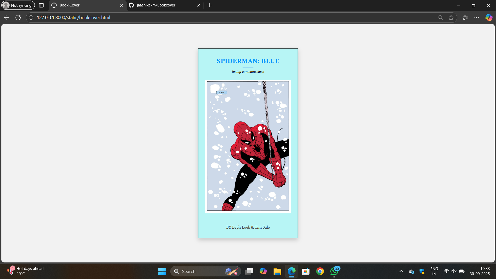

# Ex.06 Book Front Cover Page Design
## Date:07.10.25
A.DHARANI
## AIM:
To design a book front cover page using HTML and CSS.

## DESIGN STEPS:

### Step 1:
Create a Django Admin project.

### Step 2:
Create an app in the Django interface.

### Step 3:
Create a folder named 'static' in the app folder.

### Step 4:
Create a new HTML file in the static folder.

### Step 5:
Write the HTML code with relevant CSS properties.

### Step 6:
Choose the appropriate style and color scheme.

### Step 7:
Insert the images in their appropriate places.

### Step 8:
Publish the website in the LocalHost.

## PROGRAM:
```
<!DOCTYPE html>
<html lang="en">
<head>
  <meta charset="UTF-8">
  <title>Book Cover</title>
  <style>
    body {
      margin: 0;
      padding: 0;
      background-color: #f2f2f2;
      display: flex;
      justify-content: center;
      align-items: center;
      height: 100vh;
      font-family: 'Georgia', serif;
    }

    .book-cover {
      width: 400px;
      height: 800px;
      background: rgb(183, 245, 245);
      border: 2px solid #333;
      padding: 40px 30px;
      box-shadow: 0 8px 20px rgba(0, 0, 0, 0.2);
      display: flex;
      flex-direction: column;
      justify-content: space-between;
    }

    .title {
      font-size: 28px;
      font-weight: bold;
      color: #0495fc;
      text-align: center;
      line-height: 1.3;
    }

    .subtitle {
      font-size: 16px;
      margin-top: 10px;
      text-align: center;
      font-style: italic;
    }

    .image {
      flex: 1;
      background: url('https://2.bp.blogspot.com/-T45RVyhhWhQ/VxncxrOIF4I/AAAAAAAASls/Y2p7ITOguGcZSEvEXFW-TBIBA3puJPo8ACCo/s0/RCO013.jpg') center/contain no-repeat;
      margin: 30px 0;
    }

    .author {
      font-size: 18px;
      text-align: center;
      color: #444;
      margin-top: 20px;
    }

    .line {
      height: 2px;
      background: #0362f0;
      width: 50px;
      margin: 10px auto;
    }
  </style>
</head>
<body>
  <div class="book-cover">
    <div>
      <div class="title">SPIDERMAN: BLUE</div>
      <div class="line"></div>
      <div class="subtitle">losing someone close</div>
    </div>
    <div class="image">
        
    </div>
    <div class="author">BY Leph Loeb & Tim Sale</div>
  </div>
</body>
</html>
```


## OUTPUT:



## RESULT:
The program for designing book front cover page using HTML and CSS is completed successfully.
